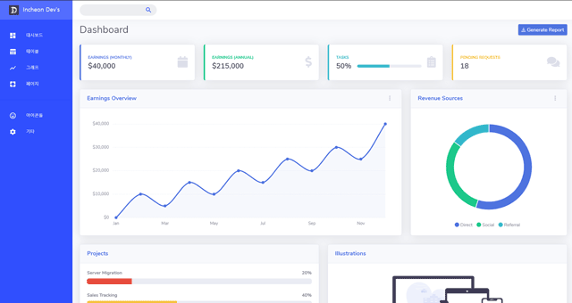

<h1 align="center"> ReactMaterialAdmin Template</h1>
<p>
  
</p>

### 소개

👋 Incheon Dev's 팀에서 만드는 React.js와 Material UI를 활용한 관리자 템플릿 프로젝트입니다.

### 미리보기



### 포함된 라이브러리

- react.js
- react-router
- material ui

### 테스트 방법

> node.js(npm)이 설치되어 있어야 합니다.

```sh
$ npm run start
[or]
$ yarn start
```

### Contact us

Incheon Dev&#39;s 🏠 [Website](https://incheon.devs.co.kr)